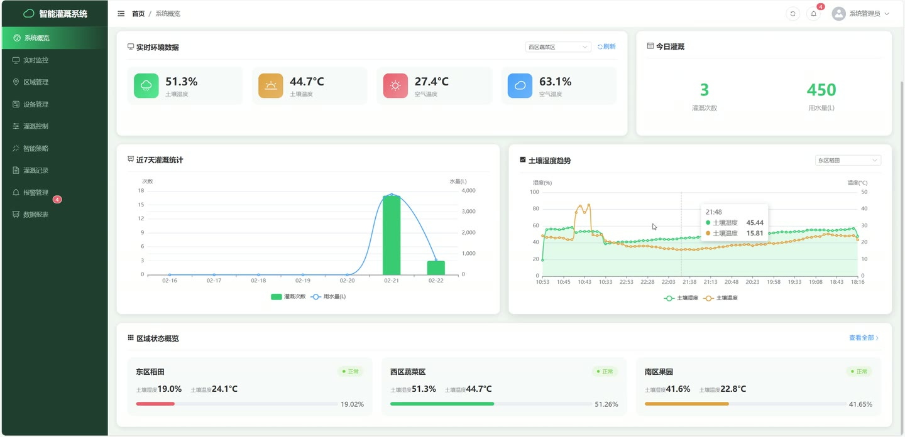
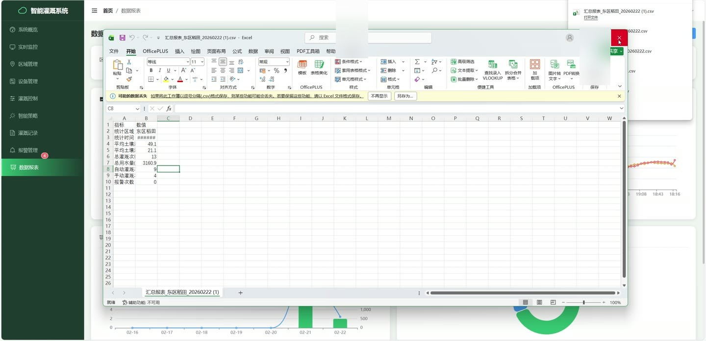
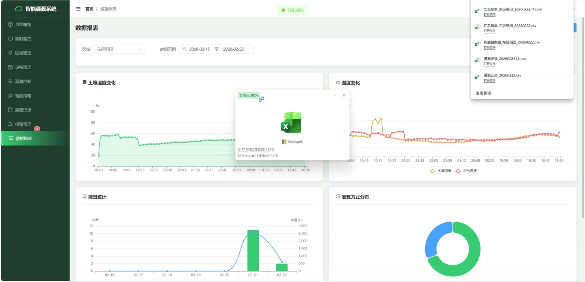
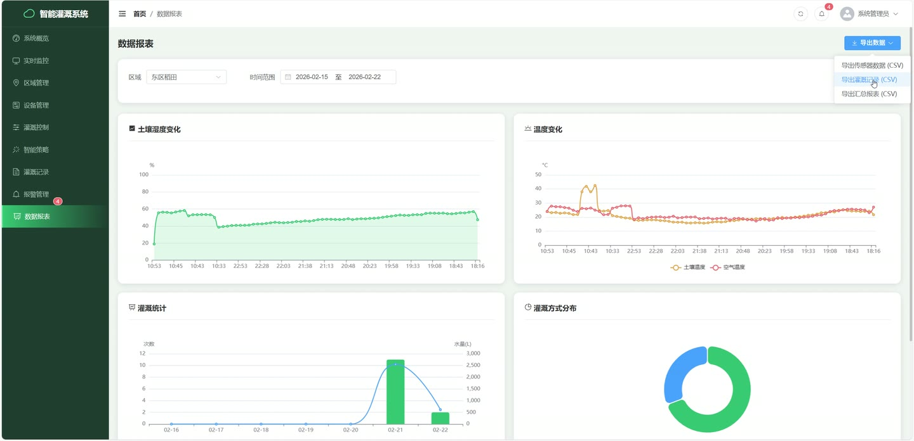
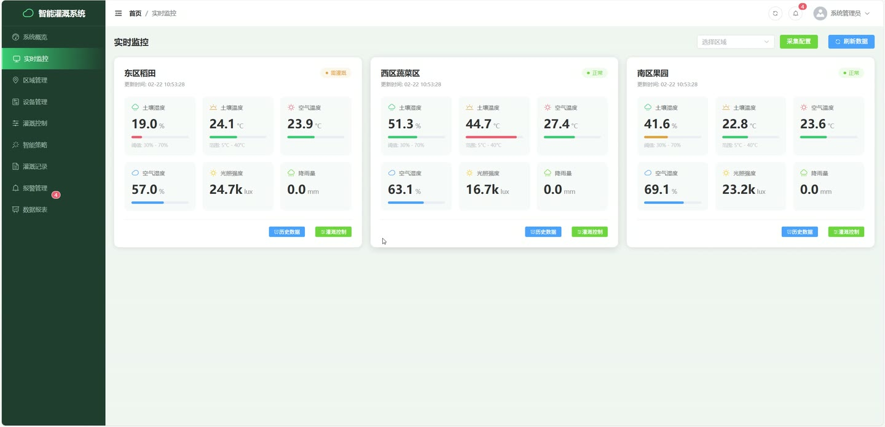
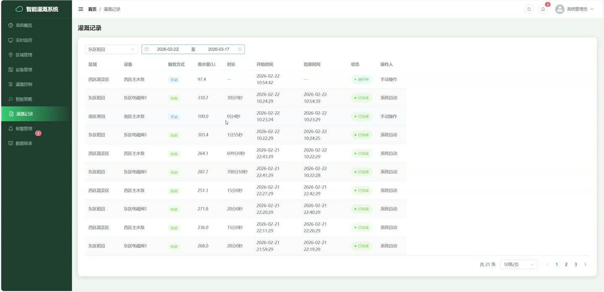

# (附文档)Springboot3+Vue3+MySQL 基于物联网的智能灌溉系统

**技术栈**：Springboot2、Vue3、MySQL

### 系统简介

基于 Spring Boot3 + Vue 3 + MySQL 前后端分离架构的智能灌溉管理系统，提供传感器数据采集、灌溉策略自动决策、设备远程控制、报警监控与数据统计等核心功能。系统包含管理员、区域运维人员等角色，支持手动/自动两种灌溉模式。
 
### 核心功能
 
### 管理员/运维人员

 
- 用户登录认证：通过用户名+密码登录，返回 JWT Token 及用户基本信息（ID、昵称、角色、头像） 
- 获取当前用户信息：根据 Token 解析用户 ID，返回用户详情（邮箱、手机号、角色） 
- 修改密码：提交原密码与新密码，校验原密码正确后更新用户密码 
- 区域管理：添加/编辑/删除农田区域，支持设置区域名称、编码、面积、作物类型、地理位置（经纬度） 
- 分页查询区域列表：支持按页号、每页条数获取区域数据，自动过滤已删除记录 
- 查看区域详情：根据区域 ID 获取单个区域的完整信息 
- 传感器设备管理：添加/编辑/删除传感器设备，绑定所属区域，记录设备编码、类型、安装时间 
- 分页查询传感器设备：支持带区域名称的分页查询，显示设备状态与最后数据上报时间 
- 获取指定区域的传感器列表：按区域 ID 查询该区域下所有未删除的传感器设备 
- 灌溉设备管理：添加/编辑/删除灌溉设备，绑定区域，记录设备类型、流量速率 
- 分页查询灌溉设备：支持带区域名称的分页查询，显示设备状态与最后操作时间 
- 获取指定区域的灌溉设备：按区域 ID 查询该区域下所有未删除的灌溉设备 
- 控制灌溉设备开关：发送设备 ID 和目标状态（0/1），更新设备运行状态并记录操作时间 
- 灌溉策略管理：添加/编辑/删除灌溉策略，设置策略名称、关联区域、作物类型、土壤湿度上下限阈值 
- 获取所有启用的灌溉策略：查询 enabled=1 且未删除的策略，按优先级降序排列，附带区域名称 
- 切换策略运行模式：指定策略 ID 和模式（auto/manual），更新策略的运行模式 
- 启用/禁用策略：提交策略 ID 和 enabled 状态值（0/1），切换策略的启用状态 
- 手动开始灌溉：选择区域、设备，填写操作人，触发灌溉并创建灌溉记录，自动计算建议水量 
- 手动停止灌溉：根据灌溉记录 ID 停止灌溉，自动更新结束时间、时长，关闭设备 
- 获取区域当前灌溉状态：按区域 ID 查询是否存在进行中的灌溉记录（status=0） 
- 检查是否需要灌溉：按区域 ID 判断当前土壤湿度是否低于策略下限阈值，返回是否需要灌溉及建议水量 
- 灌溉记录查询：支持分页、按区域 ID 筛选、按开始日期范围筛选，附带区域名称和设备名称 
- 报警记录管理：查看报警列表（支持按状态筛选），处理报警（填写处理人、处理备注），忽略报警，发送报警通知 
- 获取未处理报警数量：查询 status=0 的报警记录总数 
- 系统配置管理：查看所有配置项列表，获取/设置采集周期（1-60分钟），手动触发一次数据采集 
- 获取指定配置：按配置键名查询单个系统配置的值与描述 
- 更新配置：按配置键名更新配置值
 
### 传感器数据采集与监控

 
- 单条传感器数据上报：接收物联网设备上报的传感器数据（土壤湿度、土壤温度、空气温度、空气湿度、光照强度、降雨量），自动记录采集时间 
- 批量传感器数据上报：支持一次性提交多条传感器数据记录，统一记录采集时间戳 
- 获取所有区域最新数据：遍历所有启用区域，返回每个区域最新一条传感器数据，附带区域名称 
- 获取指定区域最新数据：按区域 ID 查询该区域最新一条传感器数据 
- 获取历史数据：按区域 ID 和时间范围（起始时间~结束时间）查询传感器数据列表，按采集时间降序排列 
- 获取区域统计数据：按区域 ID 和时间范围计算平均值（土壤湿度、土壤温度、空气温度、空气湿度、光照强度）和总降雨量 
- 获取实时监控数据：返回所有区域最新数据，并计算全区域平均值（土壤湿度、土壤温度、空气温度、空气湿度） 
- 数据导出：按区域 ID 和时间范围导出传感器数据列表 
- 自动报警检测：每次数据采集后自动检查土壤湿度是否低于下限阈值（默认30%）或高于上限阈值（默认70%），以及温度是否超过高温阈值（默认40℃）或低于低温阈值（默认5℃），符合条件则创建报警记录 
- 报警推送：创建报警时通过 WebSocket 实时推送报警信息到前端
 
### 数据统计与图表

 
- Dashboard 概览统计：获取区域总数、传感器总数、在线传感器数、灌溉设备总数、运行中设备数、未处理报警数、今日灌溉次数 
- 灌溉统计图表：按指定天数（默认7天）和区域统计每日灌溉次数、总用水量、总灌溉时长，返回日期序列数据 
- 传感器趋势图表：按区域 ID 和最近小时数（默认24小时）提取时间序列数据，包括土壤湿度、土壤温度、空气温度、空气湿度、光照强度
 
### 模拟数据生成（内置）

 
- 定时自动生成模拟传感器数据：按配置的采集周期（默认5分钟）自动为每个启用区域生成土壤湿度、土壤温度、空气温湿度、光照强度、降雨量等模拟数据 
- 模拟日夜变化：根据当前小时判断白天/夜间，自动调整空气温度和光照强度的基准值 
- 模拟异常数据：20%概率生成超阈值数据（土壤湿度过低/过高、温度过高/过低），用于触发报警测试 
- 模拟降雨：5%概率生成随机降雨量数据 
- 数据平滑变化：基于区域基准值缓慢波动，模拟真实传感器连续变化趋势 
- 手动触发采集：支持管理员手动触发一次即时数据采集并保存 
- 自动更新传感器在线状态：每次采集后更新传感器设备的最后数据时间和在线状态 
- 实时推送模拟数据：通过 WebSocket 将生成的传感器数据实时推送到前端
 
### 自动灌溉决策

 
- 定时自动灌溉检查：每分钟执行一次，遍历所有启用的自动模式策略，判断是否需要灌溉 
- 智能灌溉决策：基于当前土壤湿度与策略下限阈值比较，结合灌溉时间窗口（开始/结束时间）判断是否启动灌溉 
- 自动水量计算：根据当前湿度与目标湿度差值计算灌溉水量，每1%湿度差对应10L水，最少50L 
- 自动开启/关闭设备：决策通过后自动开启空闲灌溉设备，灌溉完成后自动关闭设备并记录时长 
- 灌溉时长调度：根据策略设置的灌溉时长，在指定时间后自动停止灌溉 
- 灌溉状态实时推送：开始/停止灌溉时通过 WebSocket 推送灌溉记录和设备状态变化
 
### 技术栈

 后端框架Spring Boot 3.x ORMMyBatis-Plus 3.5.x（BaseMapper + 自定义 SQL） 权限认证JWT（jjwt）Token 鉴权 前端框架Vue 3（Composition API） 状态管理Pinia 构建工具Vite 数据库MySQL 8.x（InnoDB） 实时通信WebSocket（Spring Messaging + STOMP） 定时任务Spring @Scheduled（模拟数据生成、自动灌溉决策） 分页插件MyBatis-Plus 分页插件 Lombok实体类简化（@Data、@RequiredArgsConstructor）
 
### 交付内容

 
- 后端完整源码 
- 前端完整源码 
- 数据库初始化脚本 
- 万字文档

## 界面展示

---

## 获取完整源码 + 万字文档

本仓库为项目介绍页。**完整前后端源码、数据库初始化脚本、万字项目文档**，请加微信 `kangkangcode`，或访问 [codekk.top](http://codekk.top) 获取。

可作课程设计 / 毕业设计参考，支持远程部署调试。